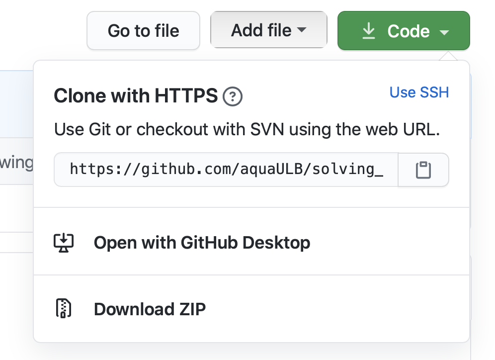

© B. Knaepen & Y. Velizhanina

# Numerical methods for partial differential equations

by Bernard Knaepen & Yelyzaveta Velizhanina

To get the local copy of the *solving_pde_mooc* repository, copy the URL of the remote repo 

and run git clone command as follows:

    git clone https://github.com/aquaULB/solving_pde_mooc.git

It will create a local directory *solving_pde_mooc* automatically initialized as a local git repository with local branch *master* tracking remote branch *origin/master*.

To see the content of the notebooks with lessons and to be able to execute the notebook cells, install [jupytext][1]. To install jupytext with conda, run:

    conda install -c conda-forge jupytext

[1]: <https://jupytext.readthedocs.io/en/latest/> "jupytext"
