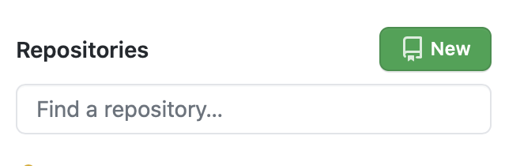
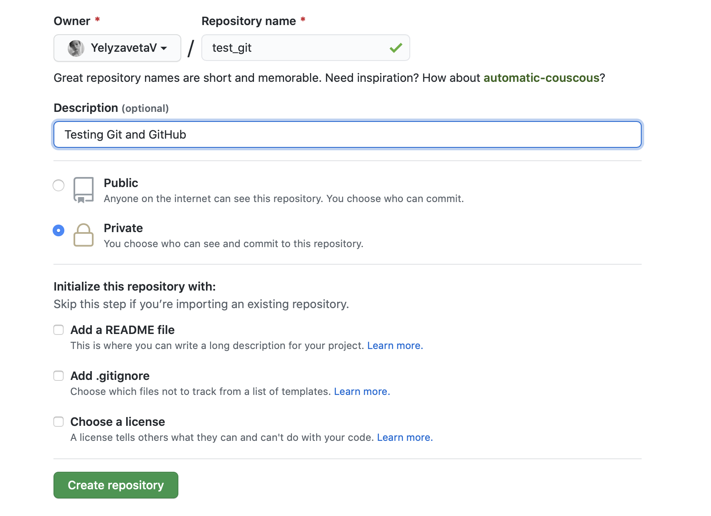
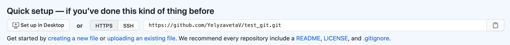

---
jupyter:
  jupytext:
    formats: ipynb,md
    text_representation:
      extension: .md
      format_name: markdown
      format_version: '1.2'
      jupytext_version: 1.6.0
  kernelspec:
    display_name: Python 3
    language: python
    name: python3
---

<div class="copyright" property="vk:rights">&copy;
  <span property="vk:dateCopyrighted">2020</span>
  <span property="vk:publisher">B. Knaepen & Y. Velizhanina</span>
</div>
<h1 style="text-align: center">Toolkit Setup</h1>


<h2 class="nocount">Contents</h2>

1. [Python and why Python](#Python-and-why-Python)
2. [Get to know Anaconda](#Get-to-know-Anaconda)
    1. [Installing Anaconda](#Installing-Anaconda)    
    2. [Creating a conda environment](#Creating-a-conda-environment)
3. [Get to know Git](#Get-to-know-Git)
    1. [Installing Git](#Installing-Git)   
    2. [Basic usage](#Basic-usage)   
        1. [Git repositories](#Git-repositories)
            * [Creating local Git repository](#Creating-local-Git-repository)
            * [Creating remote Git repository](#Creating-remote-Git-repository)
        2. [Git branches](#Git-branches)
4. [Summary](#Summary)
5. [Troubleshooting](#Troubleshooting)


## Python and why Python

All the pieces of code written in this course are written in Python 3. However, we try to make the required prior knowledge of Python as little as possible, and the reader is only expected to have a basic knowledge of any programming language and be familiar with concepts like variables, loops, conditional statements, functions etc. In fact, we also design the course in such a way that it can be viewed as a tutorial about Python numerical tools provided by numpy, matplotlib, scipy to name of few. Each time we need a new Python functionality, we try to thoroughly document it, so that the reader needs no prior knowledge of the different packages but rather learns to use them when progressing through the notebooks.

Why do we choose Python?

> [Python][00] is a clear and powerful object-oriented programming language, comparable to Perl, Ruby, Scheme, or Java.

Let's describe some of the **pros & cons** of Python.

**Pros:**

* *Simple and elegant syntax*

  Makes Python easy to learn and Python codes easy to read.
  
* *Interactive mode provided by IPython and Jupyter*

  Makes debugging very easy.
  
* *Large standard library*

  provides diverse functionality.

* *Flexible...*

  ...in terms of integration with other programming languages (C, C++, Java etc.).

* *Free and open-source*

  It means that Python can been freely used, modified and redistributed.
  
* *Wide range of additional packages* 

  We are particularly interested in those providing tools for scientific programming (NumPy, SciPy...).

**Cons:**

* *Python is natively speed-limited*

  Python is an [*interpreted*][01] language and cannot compete in speed with [*compiled*][01] languages, such as C.
  
While we've named only one disadvantage of Python, it makes Python inadequate in situations when the running speed of the program becomes crucial - for example, when doing large-scale simulations, or developing the core engine of a game.

So, whenever you discover "the disadvantage" of the programming language, keep in mind, that it is very situation-dependant. In fact, you have a very important decision to take - is my choice of programming language reasonable in this particular case, or not?

But for us Python is the perfect tool. Since we are solving *small* test problems in terms of computer resources, we are good. Moreover, it is highly probable that overall *we are not any slower than we'd be if we had chosen a C-based language*, as the development time, when programming in Python can be much smaller.

[00]: <https://wiki.python.org/moin/BeginnersGuide/Overview> "What is Python"
[01]: <https://www.freecodecamp.org/news/compiled-versus-interpreted-languages/> "Interpreted vs compiled"


## Get to know Anaconda

### Installing Anaconda

> [Anaconda][10] is a free, easy-to-install package manager, environment manager, and Python distribution with a collection of 1,500+ open source packages with free community support. Anaconda is platform-agnostic, so you can use it whether you are on Windows, macOS, or Linux.

We will install Anaconda3, as it includes Python 3.x - the latest stable version of Python. Installing Anaconda will automatically install the most useful Python packages - probably including all those that we will require throughout the course. Though, there is always a possibility to install additional packages from the Anaconda repository.

This installation file has been created in Jupyter Notebook. Jupyter Notebook provides an interactive shell for Python code, and is also included in the Anaconda distribution.

Installation instructions are provided on the official [website][11], and are quite detailed. Click on this link and install the distribution suitable for your work machine. This is a prerequisite to follow this course.

After Anaconda has been installed, we are all set to run Jupyter Notebook. Anaconda comes together with *anaconda-navigator*. This program provides a graphical interface to access Jupyter Notebook, QtConsole, Spyder etc. We recommend you learn how to work with Anaconda using the terminal, as, first, it will improve your skills of using terminal, and second, allow you to easily use conda package manager, create conda environments etc. - *programmers love the terminal*.

First, let's see how we start Jupyter Notebook through the terminal.

If you're on **MacOS or Linux**, the [.bashrc file][12] on your machine must be updated with a path to anaconda3/bin during the installation, so that each time you start a new terminal session, all the programs contained in the anaconda3/bin directory are globally accessible. It means, that if you just type `jupyter notebook` in the command line, Jupyter Notebook should start running.

If you're on **Windows** you should be you'll be able to see the program *Anaconda prompt* in the START menu just after installation. This application will start a terminal session with the content of anaconda3/bin also globally accessible.

If the `jupyter notebook` command is not recognized in the terminal after installation, refer to the [Troubleshooting section](#troubleshooting1).

### Creating a conda environment

> A [conda environment][13] is a directory that contains a specific collection of conda packages that you have installed. For example, you may have one environment with NumPy 1.7 and its dependencies, and another environment with NumPy 1.6 for legacy testing. If you change one environment, your other environments are not affected. You can easily activate or deactivate environments, which is how you switch between them.

We propose that you create a conda virtual environment for the course, and start with installing additional componentq in this environment, so that you'll have all necessary tools in an isolated space, and also learn about conda environments.

* First, create an environment with a specific version of Python

        conda create -n course python=3.8.5

  `-n` is an argument for `conda create`, which has to be followed by the name of your environment. You can replace `course` with any name you prefer. We also specify, that we want the version of Python 3.8.5.

* Next, activate your virtual environment:

        conda activate course

* Now, as virtual environment has been activated, you can use conda package manager to install some additional packages without specifying that you want them in `course`.

        conda install numpy scipy matplotlib jupyter
        conda install -c conda-forge jupytext jupyter_contrib_nbextensions

  Here `-c` refers to channel.

  > [Conda channels][14] are the locations where packages are stored. They serve as the base for hosting and managing packages. Conda packages are downloaded from remote channels, which are URLs to directories containing conda packages. The conda command searches a default set of channels, and packages are automatically downloaded and updated from https://repo.anaconda.com/pkgs/.

  conda-forge provides a remote conda channel distributing conda packages, which you sometimes cannot find in conda the `default` channel.

  We install the `jupytext` package, as it provides a possibility to save Jupyter notebooks as a simple Markdown file, and we also install `jupyter_contrib_nbextensions`, which contains a collection of extensions for Jupyter Notebook, in particular, support of LaTeX environments.

* Open Jupyter Notebook and activate the necessary extensions (from the Edit menu).


Now we are ready to go - we have a virtual environment, which includes all necessary Python packages, and we even activated extended support for LaTeX.

In case you're wondering what LaTeX is,
> [LaTeX][15] is a high-quality typesetting system; it includes features designed for the production of technical and scientific documentation. LaTeX is the de facto standard for the communication and publication of scientific documents. LaTeX is available as free software.

In order to quit the virtual environment, run:

        conda deactivate

or just close the terminal window if you don't need it anymore.

[10]: <https://docs.anaconda.com> "Anaconda"
[11]: <https://docs.anaconda.com/anaconda/install/> "Installation"
[12]: <https://www.journaldev.com/41479/bashrc-file-in-linux> "Bashrc"
[13]: <https://docs.conda.io/projects/conda/en/latest/user-guide/concepts/environments.html> "conda environment"
[14]: <https://docs.conda.io/projects/conda/en/latest/user-guide/concepts/channels.html> "conda channels"
[15]: <https://www.latex-project.org> "LaTeX"

<!-- #region -->
## Get to know Git

### Installing Git

> [Git][20] is a free and open source distributed version control system designed to handle everything from small to very large projects with speed and efficiency.

This description might be hard to comprehend at the moment, but you will learn better what is Git while working with it. What you have to know right now, is that thanks to Git, you can easily track the changes made to a project at different stages and compare all of them to each other; you can recover any older version of your project; furthermore, you can have separate *branches*, each of which stores a different version of your project without any conflict between them. Git is also a great tool for people collaborating on a project. It allows several developpers to work independently on different pieces of code and seemingly merge their contributions.

Before digging deeper into the Git toolkit, let's install it.

* If you're on Windows, you can download Git from the [official website][21] and install it with graphical installer. If, during installation, you choose all the default options, you will have git available in your Anaconda prompt.

* If you're on MacOS

    * 10.9 Mavericks or later

      Simply run

          git --version

      and it will launch the installation.

    * Before 10.9 Mavericks

      You have several [options][22]. If you already have *Xcode* installed, then you already have git. If not, we propose you to stick to the *Homebrew* option, as it's probably the most practical way to go.

        Homebrew package manager is very easy to use, and provides access to plenty of useful stuff - Firefox, GNU compiler, Qt and many many others.

        To install Homebrew, visit the [official website][23], and then just run:

            brew install git
            
        after the installation.

  Voilà, you are good to go.

* If you are on Linux, you have even [more options][24]. We propose you simply run

      apt-get install git


In all cases, check that Git is installed by running

    git --version

Output example:

    git version 2.24.3 (Apple Git-128)

### Basic usage

Now let's discuss the basic concepts of Git. Create a temporary empty directory (choose a convenient place in your computer). We will make it our first Git project. Let's call it *test_git*.

So, we run:

    mkdir test_git
    cd test_git

#### Git repositories

The whole project with all the history of changes and all the separate branches is stored in so-called *Git repository*. To create a repository, you have to `initialize` git in the directory containing your project. This creates a *local* Git repository, meaning that it currently only exist on your work machine.

##### Creating a local Git repository

In order to initialize an existing local directory as a Git repository, run:

    git init

You'll get the following output:

    Initialized empty Git repository in /path/to/test_git/.git/

As it is nicely explained [here][25], once created, each local Git repo(sitory) contains three abstract zones:

* Working space

  Includes all the components of your project in their current states.

* Staging area

  Imagine now you've introduced some modification to the state of your project, which was the last one you saved. The files, which you want to update as part of your project's history go to the staging area (after committing)

* Commit area

  Commiting your modification is a way to create a snapshot of the current, newly modified state of your project. Once you've commited your changes, the modified files are now saved in the history of your project.

Let's add a README.md file to our repo. If you're on MacOS/Linux:

    vi README.md

If you're on Windows:

    notepad README.md

Add some content to the README.md file (whathever you want) and save your modifications.

Now let's learn how to create commits. First, you tell what files to commit:

    git add README.md

The changes to README.md are not contained in the staging area.

If you run

    git add *

then all files which are new or modified will be put in the staging area for potential further commit. It is not a very clean way to go, as you might commit files which get updated at each compilation, and don't need to be tracked, like those stored in .ipynb_checkpoints directory, or object files with extension .o, etc. So always stick to always use the git add function on specific files.

We are ready to commit. Each commit has to be supplemented with a message:

    git commit -m "First commit"

You have now recorded in your git history the initial modifications of the README.md file. All the information sits locally on your computer. But we also want to be able to share our work and collaborate on projects (here we also mean being able to send your homeworks to the teaching team !).


##### Creating remote Git repository

> To be able to collaborate on any Git project, you need to know how to manage your remote repositories. [Remote repositories][26] are versions of your project that are hosted on the Internet or network somewhere.

Another reason to keep your data in a remote repo is for the sake of safety. If your computer gets broken, stolen or you accidentally remove the project's folder, then you'll loose all the local data. But if you keep it in a remote repo and update it regularly, then you can recover your whole progress from any other machine.

There are different services which allow to create and manage remote Git repositories. Throughout the course we will use GitHub.com. It is easy to use and free. Generally speaking, GitHub is a Git repository hosting service. Let's create our first remote repo on GitHub.

If you don't have GitHub account, you will have to go to GitHub.com and create one. GitHub has a graphical interface allowing you to download files to the repository, create branches, see changes in the latest commit etc. For some purposes, the GitHub interface might be quite convenient, but we advise you against uploading files directly via GitHub. It would make the whole idea of Git meaningless, and ultimately lead you to storing multiple versions of your project at the same time. We suggest that you learn how to update your project over time and keep control over the evolutionary tree of all the changes you make.

In order to create new GitHub repository, click on *New*:


Choose a name for your repository and set some description. You can make it either public - so that anyone will be able to see it - or private - only the ones you invite as collaborators will be able to see it. Click on *Create repository*.


Let's go through a small tutorial describing how you can connect your newly created remote repo to the local one.

To see, what are the current remote repositories tracked from your local repository, run the following terminal command in your local repository

    git remote

Of course, this command will output nothing, as we have not yet added any remotes.

Copy the url of your remote repo. Make sure you've chosen HTTPS format, especially if you have never used SSH.


Now go back to the terminal window and type (*replace `yourUserName` with your actual Github username*):

    git remote add origin https://github.com/yourUserName/test_git.git

If you then run

    git remote

it will output `origin`, which is the name we've assigned to our remote.

Now you should be able to run

    git push -u origin master

The normal output should look as follows:

    Enumerating objects: 3, done.
    Counting objects: 100% (3/3), done.
    Writing objects: 100% (3/3), 224 bytes | 224.00 KiB/s, done.
    Total 3 (delta 0), reused 0 (delta 0)
    To https://github.com/yourUserName/test_git.git
    * [new branch]      master -> master
    Branch 'master' set up to track remote branch 'master' from 'origin'.

Argument `-u` (equivalent to `--set-upstream`) means that we want our local branch to track remote branch `master`.

#### Git branches

> Git branches are effectively a pointer to a snapshot of your changes. When you want to add a new feature or fix a bug—no matter how big or how small—you spawn a new branch to encapsulate your changes. This makes it harder for unstable code to get merged into the main code base, and it gives you the chance to clean up your future's history before merging it into the main branch.

The very first default branch is called *master*. *Master* traditionally serves as a branch where you keep the latest, cleanest and the most stable version of your project. It is strongly advised, that you *don't ever upload temporary and test changes of your project to master*. The best way to go is to create another branch from *master*, make your modifications while being on the side branch, and then *merge* this branch into master (if desired, you may then delete the side branch). You have to be sure that the content of *Master* is working. After all, whenever you want to share your work with external people, they should be confident that they access a 100% reliable product through the master. Of course, very few codes contain no bugs at all. But ideally this is how you should consider your *Master* release.

Let's learn how to create branches. First, run:

    git branch

You'll get the following output:

    * master

As we said, you're on master. In order to switch between branches you would run `git checkout` with different arguments. Let's create a new branch called `other_branch` (or whatever you want). We run:

    git checkout -b other_branch

Which produces the following output:

    Switched to a new branch 'other_branch'

Let us now create our first python script - a file "hello.py" with the following content:

    print('Hello world!')

As you can guess, this command will output the 'Hello world!' string. Test this by running the script:

    python3 hello.py

Now we, while being on *other_branch* commit this update to the project and push it to our remote:

    git add hello.py
    git commit -m "Hello world script"
    git push
    
The last command should output the error message:

    fatal: The current branch other_branch has no upstream branch.
    To push the current branch and set the remote as upstream, use

        git push --set-upstream origin other_branch
        
This is expected. You have realized that there is a difference between local and remote branches. When creating remote repo, we have actually [manually set remote branch *master* to track local branch *master*](#notice)\*. Git hints us that we are supposed to do the same for the *other_branch*, so we run:

    git push -u origin other_branch

Now it worked. If we go back to the master branch, we'll see that our Python script is not there. 

    git checkout master

On Mac/Unix:

    ls

On Windows:

    dir

So, we have actually separated two different versions of our project into two branches. But let's say we are confident, that out *other_branch* has been perfected, and that we want to integrate the modifications in *master*. To `merge` them, we type:

    git merge other_branch
    
Check the list of files on *master* now - you'll see 'hello.py' among them. We are free to delete *other_branch*:

    git branch -d other_branch

The output should look similar to this:

    Deleted branch other_branch (was be3cca2).

We have learnt the very basics of Git, now let's clean up, as we don't need to store remote *test_git anymore*. In the menu for your repo on GitHub.com click on *Settings*, scroll to the very bottom, and click on *Delete this repository*.

[20]: <https://git-scm.com> "Git"
[21]: <https://git-scm.com/download/win> "Git Win Download"
[22]: <https://git-scm.com/download/mac> "Git Mac Download"
[23]: <https://brew.sh> "Homebrew"
[24]: <https://git-scm.com/download/linux> "Git Linux Download"
[25]: <https://www.educative.io/edpresso/what-is-git?aid=5082902844932096&utm_source=google&utm_medium=cpc&utm_campaign=edpresso-dynamic&gclid=Cj0KCQjw-uH6BRDQARIsAI3I-UdhHN9Z0GJzbOHJxNHWZH-F4atUOf6VG4914ZYxmiU0gajSGIjUH8QaAlNhEALw_wcB> "Basic Git Tutorial"
[26]: <https://git-scm.com/book/en/v2/Git-Basics-Working-with-Remotes>

<div class="notice">*<a name="notice">We advice, you always set the same names for the remote branch and the local branch, that is tracking this remote, until you're an experienced Git user, as the same name is required for pushing, but not necessary for pulling.</a></div>

## Summary

In this notebook we have fully set up the numerical tools required for the course. On top of that, we have learned the basics of conda virtual environments and Git. We are ready to get started in learning how to numerically solve partial differential equations.

## Troubleshooting

* <a name="troubleshooting1"> `jupyter notebook` command is not recognized</a>

It most surely happens, because `jupyter notebook` command is supposed to run the binary file "jupyter-notebook", which intends to run the program, but this binary file is located in a directory different from the one you are trying to open it.

In order to be able to run Jupyter Notebook from any directory, we have to run the following command:

    export PATH=/path/to/anaconda3/bin:$PATH

But this will make the files from anaconda3/bin accesible only in the active terminal window. Once you terminate it, you will have to rerun above command for each new terminal session. The solution is to add the path to anaconda3/bin to your .bashrc file.

> The [.bashrc][12] file is a script file that’s executed when a user logs in. The file itself contains a series of configurations for the terminal session. This includes setting up or enabling: coloring, completion, shell history, command aliases, and more.

So that each time you start a new terminal session, this command will be executed. To open .bashrc with in-terminal text editor you can type:

    vi .bashrc

Or, if you prefer different text editor, you can use it.

If .bashrc isn't there, it is possible that it has a different name - .zshrc, for example.

Add `export PATH=/path/to/anaconda3/bin:$PATH` to your .bashrc and save it. To get it working either open new terminal window, or run `source .bashrc` in the one, which is opened.

Now `jupyter notebook` command should work.
<!-- #endregion -->

```python
from IPython.core.display import HTML
css_file = '../Styles/notebookstyle.css'
HTML(open(css_file, 'r').read())
```
