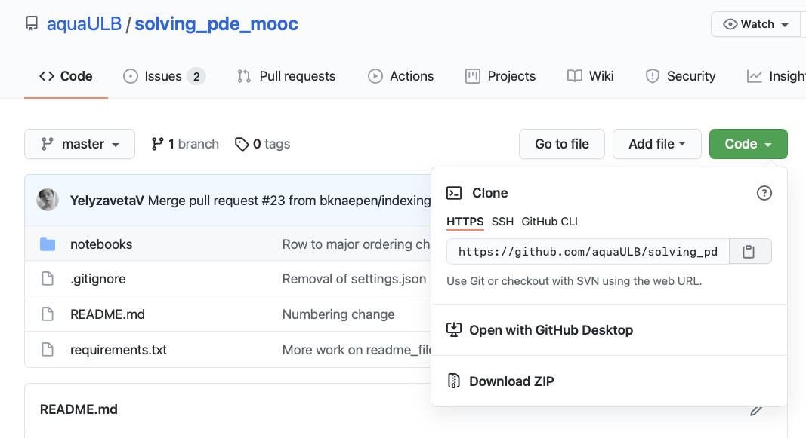
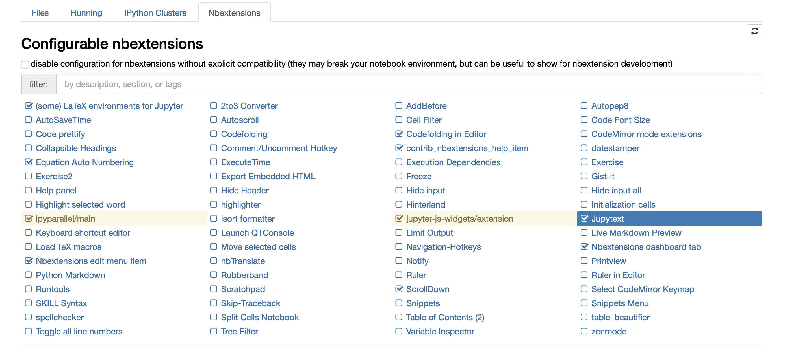

---
jupytext:
  formats: ipynb,md:myst
  notebook_metadata_filter: toc
  text_representation:
    extension: .md
    format_name: myst
    format_version: 0.13
    jupytext_version: 1.10.3
kernelspec:
  display_name: Python 3
  language: python
  name: python3
toc:
  base_numbering: 1
  nav_menu: {}
  number_sections: true
  sideBar: true
  skip_h1_title: true
  title_cell: Table of Contents
  title_sidebar: Contents
  toc_cell: true
  toc_position: {}
  toc_section_display: true
  toc_window_display: false
---

+++ {"toc": true}

<h1>Table of Contents<span class="tocSkip"></span></h1>
<div class="toc"><ul class="toc-item"><li><span><a href="#Tools-we-will-rely-on" data-toc-modified-id="Tools-we-will-rely-on-1"><span class="toc-item-num">1&nbsp;&nbsp;</span>Tools we will rely on</a></span></li><li><span><a href="#Installation" data-toc-modified-id="Installation-2"><span class="toc-item-num">2&nbsp;&nbsp;</span>Installation</a></span><ul class="toc-item"><li><span><a href="#Install-Git" data-toc-modified-id="Install-Git-2.1"><span class="toc-item-num">2.1&nbsp;&nbsp;</span>Install Git</a></span></li><li><span><a href="#Get-the-course-notes" data-toc-modified-id="Get-the-course-notes-2.2"><span class="toc-item-num">2.2&nbsp;&nbsp;</span>Get the course notes</a></span></li><li><span><a href="#Install-Anaconda" data-toc-modified-id="Install-Anaconda-2.3"><span class="toc-item-num">2.3&nbsp;&nbsp;</span>Install Anaconda</a></span></li></ul></li><li><span><a href="#Working-with-Jupyter-Notebook" data-toc-modified-id="Working-with-Jupyter-Notebook-3"><span class="toc-item-num">3&nbsp;&nbsp;</span>Working with Jupyter Notebook</a></span></li></ul></div>

+++

<div class="copyright" property="vk:rights">&copy;
  <span property="vk:dateCopyrighted">2020</span>
  <span property="vk:publisher">B. Knaepen & Y. Velizhanina</span>
</div>

# Toolkit Setup

## Tools we will rely on

* **Python 3**
  > ... clear and powerful [object-oriented programming language][1], comparable to Perl, Ruby, Scheme, or Java.

  Python has (relatively) **simple** and **elegant syntax**, is **free** and **open-sourse** and (relatively) **easy to debug** (due to being an [interpreted programming language][4]).

  Python is largely popular but still, it cannot compete in performance with compiled, statically typed programming languages, such as C++ or Fortran, when addressing certain tasks. Nevertheless, it is been widely used by C++ developers for prototyping.

* **Anaconda**
  > ... free, easy-to-install [package manager, environment manager, and Python distribution][2] with a collection of 1,500+ open source packages with free community support.

  Anaconda has been very useful for Python developers. First of all, it comes with a distribution of Python 3 and allows you an easy switch between its versions. Second, by installing Anaconda you get a package manager called conda. Using conda you can install most Python packages with a simple one-liner command.
* **Git**
  > ... is a free and open source distributed [version control system][3] designed to handle everything from small to very large projects with speed and efficiency.

  Git is used by developers to easily track and share their work. Whenever you introduce changes to your project they are tracked by git, and you can revert to any previous state at any moment. Moreover, you can create "branches" - different versions of your project at the same time. Branches are commonly used, so that multiple people can work on the same files at the same time. Besides, usage of branches allows you to keep the main workflow *clean* by storing your work in progress separately until you're sure it can be merged into the project.

  *In this course we use Git to maintain the repository with the course notes.* You will mostly use Git to stay synchronized with the state of the repo. Nevertheless, we encourage you to learn the basic usage of Git to work with your own projects, as it would be an extremely useful skill for you to acquire.

## Installation

*In this course you are expected to run basic commands via 'the command line'. In case you don't know how to open a command prompt, read how to do this on [MacOS, Linux or Windows][7].*

### Install Git

* **MacOS**

  If you are running *10.9 Mavericks or a later version of MacOS*, launch the command line and run:

      git --version
  It will start the installation of Git.

  If you are running an earlier version of MacOS, please visit [official website][8] for instructions.
* **Windows**

  Download Git from the [official website][9] and install it via graphical installer.
* **Linux**

  Open command line and run:

      apt-get install git

To check that Git was properly installed and its version, run from the command line:

    git --version

*In case you are interested in learning more about git, here is some further reading:*

* [How git works](https://hackernoon.com/understanding-git-fcffd87c15a3)
* [Guide through basic git commands](https://rogerdudler.github.io/git-guide/)

### Get the course notes

The material of this course is available online and can be alternatively accessed [on GitHub][10] or [on a dedicated webpage][11]. The second option is recommended for an easy navigation through the different chapters. However, the content is static and not suited to experiment with the various concepts we discuss. For that purpose, each chapter of the course is also distributed as a collection of Jupyter notebooks [on GitHub][10].

>The Jupyter Notebook is an open-source web application that allows you to create and share documents that contain live code, equations, visualizations and narrative text.

In a Jupyter Notebook coding is easy and interactive. In a single file you can combine [Markdown][13] *cells* and code *cells*.

*You should download the course notes on your computer by following these few steps:*

1. Create your [GitHub][14] account in case you don't have one.

2. Go to the [GitHub page][11] of the course.

3. Click the green "Code" button and copy the HTTP address of this repository.



4. Open the command line.

5. **Optional:** if you want the course notes to reside at a specific location on your computer, change the directory first.

6. Run from the command line:

        git clone https://github.com/aquaULB/solving_pde_mooc.git

    *You will be asked to enter your GitHub credentials.*

A directory named `solving_pde_mooc` will be created in your current folder. Locally, you'll have access to all of the content that is available on GitHub.

*Note that `git clone` does much more than just copies the files in their current state.* It in fact does what it says - clones, creates exact duplicate of the *remote* repository (that on GitHub). It means that you will have full access to all of the changes that will appear on GitHub. We will guide you through how to download those changes further in the course.

### Install Anaconda (or Miniconda)

*In this course we ask you to install Anaconda (or Miniconda) and provide you with a recipe to install all the required packages in one click*.

*Note that in case you are working on a ULB computer, Anaconda is already installed and you can immediately proceed to the next step.*

Both Anaconda and Miniconda come with the latest stable release of Python and the conda package manager - this is all you need to proceed to setting up your work environment.

* Install Anaconda if you do not mind dedicating several GB of your disk space to the installation, do not mind installing a large set of Python packages at once and want to have access to a graphical interface to launch applications and manage conda environments.

  To install Anaconda we refer you to the [Anaconda website][5].

* Install Miniconda if you are tight on disk space, if you don't need access to a graphical interface to manage your environments or if you prefer to only install only the Python packages that you actually need.

  For the Miniconda installation, we refer you to the [official installation guide][6].

### Setup an environment

You will now be quided through the setup of the working environment that you'll use throughout this course. To isolate it from your other projects that you might use Anaconda for, we'll use a **conda environment** -
> ... [a directory that contains a specific collection of conda packages that you have installed][10]... If you change one environment, your other environments are not affected. You can easily activate or deactivate environments, which is how you switch between them.

Open the command line and make sure you are "located" in the root directory of the course (`path/to/the/course/directory/solving_pde_mooc`). Run the following command:

    conda env create -f environment.yml

This will create a conda environment named "course" and launch the installation of multiple packages. This step only has to be done once. After that, you may activate this specific environment by typing in any terminal window,

```
conda activate course
```

*You might run into the following error:*

```
CommandNotFoundError: Your shell has not been properly configured to use 'conda activate'.
```

*Normally, the Anaconda (or Miniconda) installer should update your shell scripts to initialize conda but if it didn't, as stated in the error message, you'll have to do it manually. Run*

```
conda init
```

*and then restart you command line application. Now `conda activate` command should be recognized.*

At any time you can deactivate the environment by typing:

```
conda deactivate
```

This will switch you back to the base Anaconda environment but you can return to the "course" environment by activating it again.

**For Windows users:** In some cases, the Jupyter notebook extensions we use are not properly installed automatically when the environment is created. To finish their installation you should type the following commands in a terminal window:

```
1) conda activate course (only needed if the course environment is not yet activated in the terminal)
2) jupyter contrib nbextension install --user
3) jupyter nbextension enable varInspector/main
```

These extra steps have to be performed only once to get a functional installation.
## Working with Jupyter Notebook

We recommend that you use Jupyter notebooks to work with the course material, as it includes sample codes along with the relevant explanations.

Before trying to view the course notebooks in a Jupyter Notebook window, activate the conda environment *course* , as the notebooks rely on some of the newly installed packages. Launch the Jupyter Notebook application by running within a terminal window the following command from the `solving_pde_mooc/notebooks` folder:

```
jupyter notebook
```

The course's notebooks require some Jupyter Notebook extensions to display properly. In the extension menu check out the following boxes:



We think that the course notebooks are best displayed using a custom HTML theme. To activate it, you must execute the last cell of each notebook after opening them: 

```
from IPython.core.display import HTML
css_file = '../styles/notebookstyle.css'
HTML(open(css_file, 'r').read())
```

This will immediately apply the preconfigured styling.

[1]: <https://wiki.python.org/moin/BeginnersGuide/Overview> "What is Python"
[2]: <https://docs.anaconda.com> "Anaconda"
[3]: <https://git-scm.com> "Git"
[4]: <https://www.freecodecamp.org/news/compiled-versus-interpreted-languages/> "Interpreted vs compiled"
[5]: <https://docs.anaconda.com/anaconda/install/> "Anaconda installation"
[6]: <https://conda.io/projects/conda/en/latest/user-guide/install/index.html#regular-installation> "Miniconda installation"
[7]: <https://towardsdatascience.com/a-quick-guide-to-using-command-line-terminal-96815b97b955> "How to open command line"
[8]: <https://git-scm.com/download/mac> "Git Mac Download"
[9]: <https://git-scm.com/download/win> "Git Win Download"
[10]: <https://docs.conda.io/projects/conda/en/latest/user-guide/concepts/environments.html> "conda environment"
[11]: <https://github.com/aquaULB/solving_pde_mooc> "GitHub course notes"
[12]: <https://aquaulb.github.io/book_solving_pde_mooc/solving_pde_mooc/notebooks/01_Introduction/01_00_Preface.html> "Webbook course notes"
[13]: <https://en.wikipedia.org/wiki/Markdown> "Markdown"
[14]: <https://github.com> "GitHub"


## Summary

In this notebook, you've learnt how to set up your work environment for this course. You are now ready to dive into the main subject of the course and learn how to construct numerical solutions of partial differential equations.

```{code-cell} ipython3
from IPython.core.display import HTML
css_file = '../styles/notebookstyle.css'
HTML(open(css_file, 'r').read())
```
