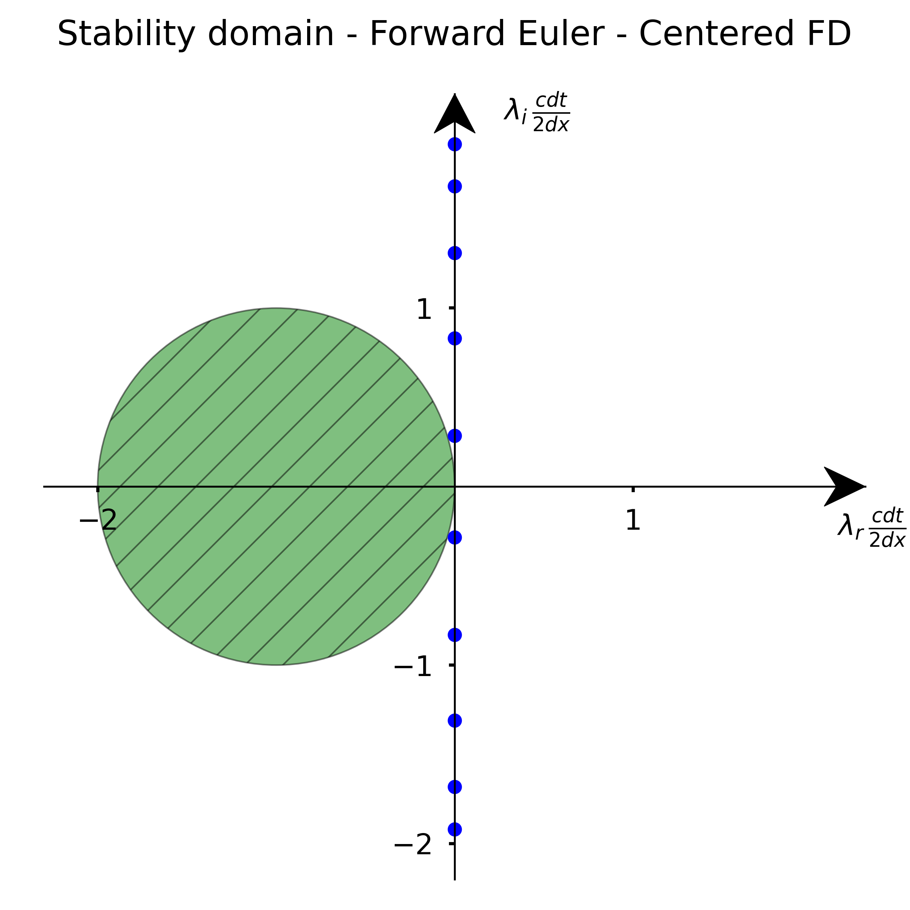

---
jupytext:
  formats: ipynb,md:myst
  notebook_metadata_filter: toc
  text_representation:
    extension: .md
    format_name: myst
    format_version: 0.12
    jupytext_version: 1.6.0
kernelspec:
  display_name: Python 3
  language: python
  name: python3
toc:
  base_numbering: 1
  nav_menu: {}
  number_sections: true
  sideBar: true
  skip_h1_title: true
  title_cell: Table of Contents
  title_sidebar: Contents
  toc_cell: true
  toc_position: {}
  toc_section_display: true
  toc_window_display: false
---

<h1 style="text-align: center">Partial differential Equation II</h1>

+++ {"toc": true}

<h1>Table of Contents<span class="tocSkip"></span></h1>
<div class="toc"><ul class="toc-item"><li><span><a href="#Introduction" data-toc-modified-id="Introduction-1"><span class="toc-item-num">1&nbsp;&nbsp;</span>Introduction</a></span></li><li><span><a href="#Stability:-matrix-analysis" data-toc-modified-id="Stability:-matrix-analysis-2"><span class="toc-item-num">2&nbsp;&nbsp;</span>Stability: matrix analysis</a></span><ul class="toc-item"><li><span><a href="#Forward-Euler-method-with-forward-first-order-finite-differentiation." data-toc-modified-id="Forward-Euler-method-with-forward-first-order-finite-differentiation.-2.1"><span class="toc-item-num">2.1&nbsp;&nbsp;</span>Forward Euler method with forward first-order finite differentiation.</a></span></li><li><span><a href="#Forward-Euler-method-with-backward-first-order-finite-differentiation." data-toc-modified-id="Forward-Euler-method-with-backward-first-order-finite-differentiation.-2.2"><span class="toc-item-num">2.2&nbsp;&nbsp;</span>Forward Euler method with backward first-order finite differentiation.</a></span></li><li><span><a href="#Forward-Euler-method-with-centered-second-order-finite-differentiation." data-toc-modified-id="Forward-Euler-method-with-centered-second-order-finite-differentiation.-2.3"><span class="toc-item-num">2.3&nbsp;&nbsp;</span>Forward Euler method with centered second-order finite differentiation.</a></span></li></ul></li><li><span><a href="#Stability:-modified-wavenumber-analysis" data-toc-modified-id="Stability:-modified-wavenumber-analysis-3"><span class="toc-item-num">3&nbsp;&nbsp;</span>Stability: modified wavenumber analysis</a></span></li></ul></div>

+++

## Introduction

For convenience, we start with importing some modules needed below:

```{code-cell} ipython3
import numpy as np
import matplotlib.pyplot as plt

%matplotlib inline

plt.style.use('../styles/mainstyle.use')
```

In the previous notebook, we have shown how to transform a partial differential equation into a system of coupled ordinary differential equations using semi-discretization. We stressed that the success of our numerical methods depends on the combination chosen for the time integration scheme *and* the spatial discretization scheme for the right-hand side. In this notebook we explore this question in more details. To illustrate the concepts, we use again the example of the first order wave equation:

$$
   \frac{\partial u}{\partial t}+c\frac{\partial u}{\partial x}=0,\label{eq:advection}
$$

+++

## Stability: matrix analysis

+++

### Forward Euler method with forward first-order finite differentiation.

The first scheme we used in the previous notebook is based on the forward Euler method for time discretization, and on the forward first-order accurate finite difference scheme for the spatial derivative. If we adopt the same notations as before, the algorithm reads:

\begin{equation}
u^{n+1}_i = u^n_i -cdt \frac{u^n_{i+1} - u^n_i}{\Delta x}
\end{equation}

With the parameters used, we saw that the solution rapidly blew up.

Let us write our algorithm in matrix notation:

\begin{equation}
    \boldsymbol{u}^{n+1} = A\boldsymbol{u}^{n}\; \; \Leftrightarrow \; \; \boldsymbol{u}^{n+1} = A^{n+1}\boldsymbol{u}^{0}
\end{equation}

As previously (see previous notebook), we adopt homogeneous Dirichlet boundary conditions: $u_0^m = u_{nx-1}^m=0, \forall m$. This means that our unknowns are $u^m_1,\ldots,u^m_{nx-2}$ and that the matrix $A$ has dimensions $(nx-2)\times (nx-2)$. Its expression is:

\begin{align}
A = 
\begin{pmatrix}
\lambda & 1 & 0 & 0 & 0 & \dots & 0 & 0 & 0 & 0\\
0 & \lambda & 1 & 0 & 0 & \dots & 0 & 0 & 0 & 0 \\
0 & 0 & \lambda & 1 & 0 & \dots & 0 & 0 & 0 & 0 \\
0 & \dots & \dots & \dots & \dots & \dots & \dots & \dots & \dots & 0 \\
0 & \dots & \dots & \dots & \dots & \dots & \dots & \dots & \dots & 0 \\
0 & 0 & 0 & 0  & \dots & 0 & \lambda & 1 & 0 & 0 \\
0 & 0 & 0 & 0 & \dots & 0 & 0 & \lambda & 1 & 0 \\
0 & 0 & 0 & 0 & \dots & 0 & 0 & 0 & \lambda & 1 \\
0 & 0 & 0 & 0 & \dots & 0 & 0 & 0 & 0 & \lambda
\end{pmatrix}.
\end{align}

where $\displaystyle{\lambda=-(1+\frac{dx}{cdt})}$. In linear algebra terminology, $A$ has the form of a Jordan block.

A useful result for us is that the powers of a Jordan block may be evaluated without too much effort. As an example, let's consider the powers of a $5\times 5$ Jordan block:

\begin{align}
\begin{pmatrix}
 \lambda & 1 & 0 & 0 & 0 \\
 0 & \lambda & 1 & 0 & 0 \\
 0 & 0 & \lambda & 1 & 0 \\ 
 0 & 0 & 0 & \lambda & 1 \\
 0 & 0 & 0 & 0 & \lambda
\end{pmatrix}^n
=\begin{pmatrix}
 \lambda^n & \tbinom{n}{1}\lambda^{n-1} & \tbinom{n}{2}\lambda^{n-2} & \tbinom{n}{3}\lambda^{n-3}   & \tbinom{n}{4}\lambda^{n-4} \\
 0  & \lambda^n & \tbinom{n}{1}\lambda^{n-1} & \tbinom{n}{2}\lambda^{n-2}   & \tbinom{n}{3}\lambda^{n-3} \\
 0  & 0  & \lambda^n & \tbinom{n}{1}\lambda^{n-1}   & \tbinom{n}{2}\lambda^{n-2} \\ 
 0  & 0  & 0  & \lambda^n & \tbinom{n}{1}\lambda^{n-1} \\
 0  & 0  & 0  & 0   & \lambda^n
\end{pmatrix}
\end{align}

where the binomial coefficients are defined as $\tbinom{n}{k}=\prod_{i=1}^k \tfrac{n+1-i}{i}$. One can show that the matrix entries remain bounded if and only if $\vert \lambda \vert <1$ - the fact that the entries blow up for $\vert \lambda \vert \geq 1$ is evident. A detailed proof of this property may be found in \cite{HornJohnson2013}.

For the forward Euler method with forward first-order finite differentiation, we have $\displaystyle{\lambda=-(1+\frac{dx}{cdt})}$. Therefore we cannot choose $dt$ in such a way that $\vert \lambda \vert >0$. The matrix will blow up and so will our numerical solution $\boldsymbol{u}^{n+1}$ as $n\rightarrow \infty$ !

+++

### Forward Euler method with backward first-order finite differentiation.

We now turn our attention to the second method we used in the previous notebook. Instead of the forward first-order finite differentiation we used the backward first-order finite differentiation.

The time marching then proceeds as,

\begin{equation}
u^{n+1}_i = u^n_i -cdt \frac{u^n_{i} - u^n_{i-1}}{\Delta x}
\end{equation}

In matrix notation we have,

\begin{equation}
    \boldsymbol{u}^{n+1} = \tilde A\boldsymbol{u}^{n}\; \; \Leftrightarrow \; \; \boldsymbol{u}^{n+1} = \tilde A^{n+1}\boldsymbol{u}^{0}
\end{equation}

If we use the same boundary conditions as before, the matrix $\tilde A$ is expressed as,

\begin{align}
\tilde A = 
\begin{pmatrix}
\tilde \lambda & 0 & 0 & 0 & 0 & \dots & 0 & 0 & 0 & 0\\
1 & \tilde \lambda & 0 & 0 & 0 & \dots & 0 & 0 & 0 & 0 \\
0 & 1 & \tilde \lambda & 0 & 0 & \dots & 0 & 0 & 0 & 0 \\
0 & \dots & \dots & \dots & \dots & \dots & \dots & \dots & \dots & 0 \\
0 & \dots & \dots & \dots & \dots & \dots & \dots & \dots & \dots & 0 \\
0 & 0 & 0 & 0  & \dots & 1 & \tilde \lambda & 0 & 0 & 0 \\
0 & 0 & 0 & 0 & \dots & 0 & 1 & \tilde \lambda & 0 & 0 \\
0 & 0 & 0 & 0 & \dots & 0 & 0 & 1 & \tilde \lambda & 0 \\
0 & 0 & 0 & 0 & \dots & 0 & 0 & 0 & 1 & \tilde \lambda
\end{pmatrix},
\end{align}

with $\displaystyle{\tilde \lambda = \frac{dx}{cdt}-1}$. This time, $\tilde A$ is the transpose of a Jordan block. Using the same argument as in the previous section, we conclude that the power of $\tilde A$ will remain bounded if and only if $\vert \tilde \lambda \vert \leq 1$. Compared to the case of the forward Euler method with forward first-order finite differentiation, the situation is therefore very different. By choosing $dt$ such that,

\begin{equation}
 dt < \frac{dx}{dc} \label{eq:cfl}
\end{equation}

we can avoid instability in our toy problem when using the Forward Euler method with backward first-order finite differentiation. Go back to the previous notebook and check that this criteria was indeed satisfied. Run again the simulation with $dt > \frac{c}{dx}$ and check what happens.

The non-dimensional number,

\begin{equation}
C = \frac{cdt}{dx}
\end{equation}

is called the CFL number after the mathematicians Courant, Friedrich and Lewy. Here the condition for stability:

\begin{equation}
C<1
\end{equation}

This condition limits the allowed time step for a given grid spacing and has a very important practical consequence. If you increase the numerical resolution by using a finer grid, you also need to reduce the time step. You pay the price twice.

+++

### Forward Euler method with centered second-order finite differentiation.

+++

Let us study the stability of one more discretization scheme through matrix analysis. 

Consider the forward Euler method with centered second-order finite differentiation. The algorithm reads:

\begin{equation}
u^{n+1}_i = u^n_i -cdt \frac{u^n_{i+1} - u^n_{i-1}}{2\Delta x}
\end{equation}

In matrix notation, we can write:

\begin{equation}
    \boldsymbol{u}^{n+1} = (I-\frac{cdt}{2\Delta x}B)\boldsymbol{u}^{n}\; \; \Leftrightarrow \; \; \boldsymbol{u}^{n+1} = (I-\frac{cdt}{2\Delta x}B)^{n+1}\boldsymbol{u}^{0}
\end{equation}

Using our usual boundary conditions, the discretization matrix $B$ is defined as:

\begin{align}
B =
\begin{pmatrix}
0 & -1 & 0 & 0 & 0 & \dots & 0 & 0 & 0 & 0\\
1 & 0 & -1 & 0 & 0 & \dots & 0 & 0 & 0 & 0 \\
0 & 1 & 0 & -1 & 0 & \dots & 0 & 0 & 0 & 0 \\
0 & \dots & \dots & \dots & \dots & \dots & \dots & \dots & \dots & 0 \\
0 & \dots & \dots & \dots & \dots & \dots & \dots & \dots & \dots & 0 \\
0 & 0 & 0 & 0  & \dots & 1 & 0 & -1 & 0 & 0 \\
0 & 0 & 0 & 0 & \dots & 0 & 1 & 0 & -1 & 0 \\
0 & 0 & 0 & 0 & \dots & 0 & 0 & 1 & 0 & -1 \\
0 & 0 & 0 & 0 & \dots & 0 & 0 & 0 & 1 & 0
\end{pmatrix}.
\end{align}

This matrix belongs to the family of triadiagonal Toeplitz matrices. Their general form is:

\begin{align}
T_m = 
\begin{pmatrix}
a & b & 0 & 0 & 0 & \dots & 0 & 0 & 0 & 0\\
c & a & b & 0 & 0 & \dots & 0 & 0 & 0 & 0 \\
0 & c & a & b & 0 & \dots & 0 & 0 & 0 & 0 \\
0 & \dots & \dots & \dots & \dots & \dots & \dots & \dots & \dots & 0 \\
0 & \dots & \dots & \dots & \dots & \dots & \dots & \dots & \dots & 0 \\
0 & 0 & 0 & 0  & \dots & c & a & b & 0 & 0 \\
0 & 0 & 0 & 0 & \dots & 0 & c & a & b & 0 \\
0 & 0 & 0 & 0 & \dots & 0 & 0 & c & a & b \\
0 & 0 & 0 & 0 & \dots & 0 & 0 & 0 & c & a \\
\end{pmatrix}
\end{align}

where $m\times m$ are the matrix dimensions. Contrary to the matrices $A$ and $\tilde A$ described earlier, $T_m$ is diagonalizable when $bc \not = 0$. The eigenvalues are then distinct and given by \cite{HornJohnson2013}:

\begin{equation}
\lambda_k = (a+2\sqrt{bc}\cos(\frac{\pi k}{m+1})),\; k=1,\ldots, m. \label{eq:eigenvals1}
\end{equation}

This property is very useful here as it allows us to make a direct connexion with the stability analysis discussed in the notebook *02_01_EulerMethod*. To that end, let us denote by $\boldsymbol{z}^{m}$ the coordinates of $\boldsymbol{u}^m$ in the basis of eigenvectors. Because $B$ is diagonal in this basis we have:

\begin{equation}
    \boldsymbol{z}^{n+1} = (I-\frac{cdt}{2\Delta x}\Lambda) \boldsymbol{z}^{n}
    \; \; \Leftrightarrow \; \; \boldsymbol{z}^{n+1} = (I-\frac{cdt}{2\Delta x}\Lambda)^{n+1}\boldsymbol{z}^{0}
\end{equation}

where $\Lambda$ is the diagonal matrix built with the $(nx-2)$ eigenvalues of $B$. In these coordinates, our problem is reduced to a system of $nx-2$ uncoupled equations.

Our solution will remain finite as long as the condition $\vert 1  -\frac{cdt}{2\Delta x}\Lambda_k\vert <1, \forall k$. Unfortunately there is no way to satisfy these constraints as the eigenvalues $\eqref{eq:eigenvals1}$ are purely imaginary with $b=-1$ and $c=1$. In other words, all the eigenvalues lie outside the stability domain of the forward Euler scheme. In the figure below we recall the stability region of the forward Euler scheme and plot the coordinates of the eigenvalues for the case $nx=12.$

+++



+++

## Stability: modified wavenumber analysis

```{code-cell} ipython3
from IPython.core.display import HTML
css_file = '../styles/notebookstyle.css'
HTML(open(css_file, 'r').read())
```

```{code-cell} ipython3

```

# References

<mark> <b>The bib file biblio.bib was not found

</b> </mark>(<a id="cit-HornJohnson2013" href="#call-HornJohnson2013">?</a>) !! _This reference was not found in biblio.bib _ !!
