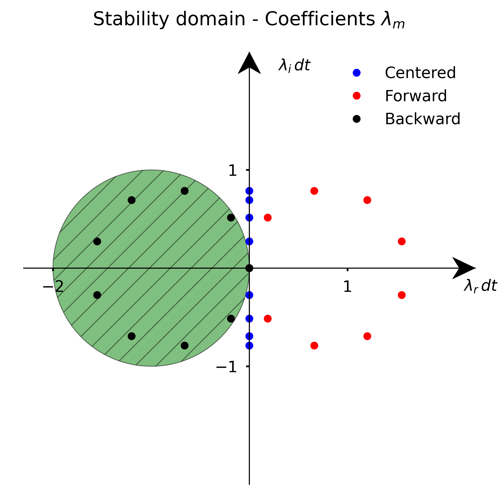

---
jupytext:
  formats: ipynb,md:myst
  notebook_metadata_filter: toc
  text_representation:
    extension: .md
    format_name: myst
    format_version: 0.13
    jupytext_version: 1.10.3
kernelspec:
  display_name: Python 3
  language: python
  name: python3
toc:
  base_numbering: 1
  nav_menu: {}
  number_sections: true
  sideBar: true
  skip_h1_title: true
  title_cell: Table of Contents
  title_sidebar: Contents
  toc_cell: true
  toc_position: {}
  toc_section_display: true
  toc_window_display: false
---

<div class="copyright" property="vk:rights">&copy;
  <span property="vk:dateCopyrighted">2020</span>
  <span property="vk:publisher">B. Knaepen & Y. Velizhanina</span>
</div>

# Matrix and modified wavenumber stability analysis

+++ {"toc": true}

<h1>Table of Contents<span class="tocSkip"></span></h1>
<div class="toc"><ul class="toc-item"><li><span><a href="#Introduction" data-toc-modified-id="Introduction-1"><span class="toc-item-num">1&nbsp;&nbsp;</span>Introduction</a></span></li><li><span><a href="#Stability:-matrix-analysis" data-toc-modified-id="Stability:-matrix-analysis-2"><span class="toc-item-num">2&nbsp;&nbsp;</span>Stability: matrix analysis</a></span><ul class="toc-item"><li><span><a href="#Forward-Euler-method-with-first-order-forward-finite-differentiation." data-toc-modified-id="Forward-Euler-method-with-first-order-forward-finite-differentiation.-2.1"><span class="toc-item-num">2.1&nbsp;&nbsp;</span>Forward Euler method with first-order forward finite differentiation.</a></span></li><li><span><a href="#Forward-Euler-method-with-backward-first-order-finite-differentiation." data-toc-modified-id="Forward-Euler-method-with-backward-first-order-finite-differentiation.-2.2"><span class="toc-item-num">2.2&nbsp;&nbsp;</span>Forward Euler method with backward first-order finite differentiation.</a></span></li><li><span><a href="#Forward-Euler-method-with-centered-second-order-finite-differentiation." data-toc-modified-id="Forward-Euler-method-with-centered-second-order-finite-differentiation.-2.3"><span class="toc-item-num">2.3&nbsp;&nbsp;</span>Forward Euler method with centered second-order finite differentiation.</a></span></li></ul></li><li><span><a href="#Stability:-modified-wavenumber-analysis" data-toc-modified-id="Stability:-modified-wavenumber-analysis-3"><span class="toc-item-num">3&nbsp;&nbsp;</span>Stability: modified wavenumber analysis</a></span><ul class="toc-item"><li><span><a href="#Forward-finite-differentiation" data-toc-modified-id="Forward-finite-differentiation-3.1"><span class="toc-item-num">3.1&nbsp;&nbsp;</span>Forward finite differentiation</a></span></li><li><span><a href="#Centered-finite-differentiation" data-toc-modified-id="Centered-finite-differentiation-3.2"><span class="toc-item-num">3.2&nbsp;&nbsp;</span>Centered finite differentiation</a></span></li><li><span><a href="#Backward-finite-differentiation" data-toc-modified-id="Backward-finite-differentiation-3.3"><span class="toc-item-num">3.3&nbsp;&nbsp;</span>Backward finite differentiation</a></span></li><li><span><a href="#Graphical-summary" data-toc-modified-id="Graphical-summary-3.4"><span class="toc-item-num">3.4&nbsp;&nbsp;</span>Graphical summary</a></span></li></ul></li><li><span><a href="#Summary" data-toc-modified-id="Summary-4"><span class="toc-item-num">4&nbsp;&nbsp;</span>Summary</a></span></li><li><span><a href="#Exercises" data-toc-modified-id="Exercises-5"><span class="toc-item-num">5&nbsp;&nbsp;</span>Exercises</a></span></li></ul></div>

+++

## Introduction

+++

For convenience, we start by importing some modules needed below:

```{code-cell} ipython3
import numpy as np
import matplotlib.pyplot as plt

%matplotlib inline

plt.style.use('../styles/mainstyle.use')
```

In the previous notebook, we have shown how to transform a partial differential equation into a system of coupled ordinary differential equations using semi-discretization. We stressed that the success of our numerical methods depends on the combination chosen for the time integration scheme *and* the spatial discretization scheme for the right-hand side. In this notebook we explore this question in more details. To illustrate the concepts, we use again the example of the first order wave equation:

$$
  \frac{\partial u}{\partial t}+c\frac{\partial u}{\partial x}=0,\; c>0.
$$

Before proceeding, we recall an important result discussed in notebook `02_01_EulerMethod`. If an equation takes the form:

$$
\label{eq:basicForm}
  \frac{dx}{dt}=\lambda x
$$

for any complex number $\lambda$, the forward Euler integration scheme provides a bounded solution only if $\lambda dt$ is contained in its stability domain. For the forward Euler method, the stability domain consists of disk of radius $1$ in the complex plane $z=x+iy$, centered around the point $x=-1$.

Although we focus in this notebook on the forward Euler method for simplicity, the discussion can be readily adapted to other time integration schemes.

+++

## Stability: matrix analysis

+++

### Forward Euler method with first-order forward finite differentiation.

The first scheme we used in the previous notebook is based on the forward Euler method for time discretization, and on the forward first-order accurate finite difference scheme for the spatial derivative. If we adopt the same notations as before, the algorithm reads:

\begin{equation}
u^{n+1}_i = u^n_i -cdt \frac{u^n_{i+1} - u^n_i}{\Delta x}.
\end{equation}

With the parameters used, we saw that the solution rapidly blew up.

Let us write our algorithm in matrix notation:

\begin{equation}
    \boldsymbol{u}^{n+1} = A\boldsymbol{u}^{n}\; \; \Leftrightarrow \; \; \boldsymbol{u}^{n+1} = A^{n+1}\boldsymbol{u}^{0}.
\end{equation}

As before (see previous notebook), we adopt homogeneous Dirichlet boundary conditions: $u_0^m = u_{nx-1}^m=0, \forall m$. This means that our unknowns are $u^m_1,\ldots,u^m_{nx-2}$ and that the matrix $A$ has dimensions $(nx-2)\times (nx-2)$. Its expression is:

\begin{align}
A = \alpha
\begin{pmatrix}
\lambda & 1 & 0 & 0 & 0 & \dots & 0 & 0 & 0 & 0\\
0 & \lambda & 1 & 0 & 0 & \dots & 0 & 0 & 0 & 0 \\
0 & 0 & \lambda & 1 & 0 & \dots & 0 & 0 & 0 & 0 \\
0 & \dots & \dots & \dots & \dots & \dots & \dots & \dots & \dots & 0 \\
0 & \dots & \dots & \dots & \dots & \dots & \dots & \dots & \dots & 0 \\
0 & 0 & 0 & 0  & \dots & 0 & \lambda & 1 & 0 & 0 \\
0 & 0 & 0 & 0 & \dots & 0 & 0 & \lambda & 1 & 0 \\
0 & 0 & 0 & 0 & \dots & 0 & 0 & 0 & \lambda & 1 \\
0 & 0 & 0 & 0 & \dots & 0 & 0 & 0 & 0 & \lambda
\end{pmatrix}.
\end{align}

where $\displaystyle{\lambda=-(1+\frac{dx}{cdt})}$ and $\displaystyle \alpha = -\frac{cdt}{dx}$ In linear algebra terminology, $A$ has the form of a Jordan block (up to a multiplicative number).

A useful result for us is that the powers of a Jordan block may be evaluated without too much effort. As an example, let's consider the powers of a $5\times 5$ Jordan block:

\begin{align}
\begin{pmatrix}
 \lambda & 1 & 0 & 0 & 0 \\
 0 & \lambda & 1 & 0 & 0 \\
 0 & 0 & \lambda & 1 & 0 \\ 
 0 & 0 & 0 & \lambda & 1 \\
 0 & 0 & 0 & 0 & \lambda
\end{pmatrix}^n
=\begin{pmatrix}
 \lambda^n & \tbinom{n}{1}\lambda^{n-1} & \tbinom{n}{2}\lambda^{n-2} & \tbinom{n}{3}\lambda^{n-3}   & \tbinom{n}{4}\lambda^{n-4} \\
 0  & \lambda^n & \tbinom{n}{1}\lambda^{n-1} & \tbinom{n}{2}\lambda^{n-2}   & \tbinom{n}{3}\lambda^{n-3} \\
 0  & 0  & \lambda^n & \tbinom{n}{1}\lambda^{n-1}   & \tbinom{n}{2}\lambda^{n-2} \\ 
 0  & 0  & 0  & \lambda^n & \tbinom{n}{1}\lambda^{n-1} \\
 0  & 0  & 0  & 0   & \lambda^n
\end{pmatrix}
\end{align}

where the binomial coefficients are defined as $\tbinom{n}{k}=\prod_{i=1}^k \tfrac{n+1-i}{i}$. One can show that the matrix entries remain bounded if and only if $\vert \lambda \vert <1$ - the fact that the entries blow up for $\vert \lambda \vert \geq 1$ is evident. A detailed proof of this property may be found in \cite{horn2013}. In terms of $A$ we have:

\begin{align}
A^n 
=\begin{pmatrix}
 \beta^n & \alpha\tbinom{n}{1}\beta^{n-1} & \alpha^2\tbinom{n}{2}\beta^{n-2} & \alpha^3\tbinom{n}{3}\beta^{n-3}   & \alpha^4\tbinom{n}{4}\beta^{n-4} \\
 0  & \beta^n & \alpha\tbinom{n}{1}\beta^{n-1} & \alpha^2\tbinom{n}{2}\beta^{n-2}   & \alpha^3\tbinom{n}{3}\beta^{n-3} \\
 0  & 0  & \beta^n & \alpha\tbinom{n}{1}\beta^{n-1}   & \alpha^2\tbinom{n}{2}\beta^{n-2} \\ 
 0  & 0  & 0  & \beta^n & \alpha\tbinom{n}{1}\beta^{n-1} \\
 0  & 0  & 0  & 0   & \beta^n
\end{pmatrix}
\end{align}

with $\displaystyle{\beta=1+\frac{cdt}{dx}}$. Similarly to the case of an exact Jordan block, the matrix entries remain bounded if and only if $\vert \beta \vert < 1$ and this condition cannot be satisfied here.

The entries of the discretization matrix $A$ are specific to the combined choice of the forward Euler method and the forward first-order finite differentiation. As these entries blow up as we power iterate the matrix, whatever the value of $dt$, this choice of discretization is *unconditionnally unstable* for the first order wave equation (and $c>0$).

+++

### Forward Euler method with backward first-order finite differentiation.

We now turn our attention to the second method we used in the previous notebook. Instead of the first-order forward finite differentiation we used the first-order backward finite differentiation.

The time marching then proceeds as,

\begin{equation}
u^{n+1}_i = u^n_i -cdt \frac{u^n_{i} - u^n_{i-1}}{\Delta x}.
\end{equation}

In matrix notation we have,

\begin{equation}
    \boldsymbol{u}^{n+1} = \tilde A\boldsymbol{u}^{n}\; \; \Leftrightarrow \; \; \boldsymbol{u}^{n+1} = \tilde A^{n+1}\boldsymbol{u}^{0}.
\end{equation}

If we use the same boundary conditions as before, the matrix $\tilde A$ is expressed as,

\begin{align}
\tilde A = \tilde \alpha
\begin{pmatrix}
\tilde \lambda & 0 & 0 & 0 & 0 & \dots & 0 & 0 & 0 & 0\\
1 & \tilde \lambda & 0 & 0 & 0 & \dots & 0 & 0 & 0 & 0 \\
0 & 1 & \tilde \lambda & 0 & 0 & \dots & 0 & 0 & 0 & 0 \\
0 & \dots & \dots & \dots & \dots & \dots & \dots & \dots & \dots & 0 \\
0 & \dots & \dots & \dots & \dots & \dots & \dots & \dots & \dots & 0 \\
0 & 0 & 0 & 0  & \dots & 1 & \tilde \lambda & 0 & 0 & 0 \\
0 & 0 & 0 & 0 & \dots & 0 & 1 & \tilde \lambda & 0 & 0 \\
0 & 0 & 0 & 0 & \dots & 0 & 0 & 1 & \tilde \lambda & 0 \\
0 & 0 & 0 & 0 & \dots & 0 & 0 & 0 & 1 & \tilde \lambda
\end{pmatrix},
\end{align}

with $\displaystyle{\tilde \lambda = \frac{dx}{cdt}-1}$ and $\displaystyle \tilde \alpha = \frac{cdt}{dx}$ This time, $\tilde A$ is the transpose of a Jordan block (up to a multiplicative factor). Using the same argument as in the previous section, we conclude that the powers of $\tilde A$ will remain bounded if and only if $\vert \tilde \beta \vert \leq 1$ with $\displaystyle \tilde \beta = 1-\frac{cdt}{dx}$. Compared to the case of the forward Euler method with forward first-order finite differentiation, the situation is therefore very different. By choosing $dt$ such that,

\begin{equation}
\label{eq:cfl}
 dt < \frac{2dx}{c}
\end{equation}

we can avoid exponential blow up of the solution for $t\rightarrow \infty$ when using the forward Euler method with backward first-order finite differentiation. However, even if the method does not blow up, it does not mean that we would get an accurate physical solution when fullfilling the above criteria. Errors can still experience very large transient growth at finite times and this necessary condition is not sufficient to ensure a proper solution to our problem. This ultimately boils down to the fact that the matrix $A$ is highly non-normal. For the present scheme, the proper criteria to adopt is $dt < \frac{dx}{c}$ \cite{leveque2007}. Go back to the previous notebook and check that this criteria was indeed satisfied. Run again the simulation with $dt > \displaystyle\frac{dx}{c}$ and check what happens.

The non-dimensional number,

\begin{equation}
C = \frac{cdt}{dx}
\end{equation}

is called the CFL number after the mathematicians Courant, Friedrich and Lewy. Here the condition for stability at finite and long times is:

\begin{equation}
C<1.
\end{equation}

This condition limits the allowed time step for a given grid spacing and has a very important practical consequence. If you increase the numerical resolution by using a finer grid, you also need to reduce the time step. You pay the price twice. But at least the method is *conditionnally stable* for the first order wave equation (and $c>0$).

+++

### Forward Euler method with centered second-order finite differentiation.

Let us study the stability of one more discretization scheme through matrix analysis. 

Consider the forward Euler method with centered second-order finite differentiation. The algorithm reads:

\begin{equation}
u^{n+1}_i = u^n_i -cdt \frac{u^n_{i+1} - u^n_{i-1}}{2\Delta x}
\end{equation}

In matrix notation, we can write:

\begin{equation}
\label{eq:iterunp1}
    \boldsymbol{u}^{n+1} = (I+\frac{cdt}{2\Delta x}B)\boldsymbol{u}^{n}\; \; \Leftrightarrow \; \; \boldsymbol{u}^{n+1} = (I+\frac{cdt}{2\Delta x}B)^{n+1}\boldsymbol{u}^{0}
\end{equation}

Using our usual boundary conditions, the matrix $B$ is defined as:

\begin{align}
\label{eq:discB}
B =
\begin{pmatrix}
0 & -1 & 0 & 0 & 0 & \dots & 0 & 0 & 0 & 0\\
1 & 0 & -1 & 0 & 0 & \dots & 0 & 0 & 0 & 0 \\
0 & 1 & 0 & -1 & 0 & \dots & 0 & 0 & 0 & 0 \\
0 & \dots & \dots & \dots & \dots & \dots & \dots & \dots & \dots & 0 \\
0 & \dots & \dots & \dots & \dots & \dots & \dots & \dots & \dots & 0 \\
0 & 0 & 0 & 0  & \dots & 1 & 0 & -1 & 0 & 0 \\
0 & 0 & 0 & 0 & \dots & 0 & 1 & 0 & -1 & 0 \\
0 & 0 & 0 & 0 & \dots & 0 & 0 & 1 & 0 & -1 \\
0 & 0 & 0 & 0 & \dots & 0 & 0 & 0 & 1 & 0
\end{pmatrix}.
\end{align}

This matrix belongs to the family of triadiagonal Toeplitz matrices. Their general form is:

\begin{align}
T_m = 
\begin{pmatrix}
a & b & 0 & 0 & 0 & \dots & 0 & 0 & 0 & 0\\
c & a & b & 0 & 0 & \dots & 0 & 0 & 0 & 0 \\
0 & c & a & b & 0 & \dots & 0 & 0 & 0 & 0 \\
0 & \dots & \dots & \dots & \dots & \dots & \dots & \dots & \dots & 0 \\
0 & \dots & \dots & \dots & \dots & \dots & \dots & \dots & \dots & 0 \\
0 & 0 & 0 & 0  & \dots & c & a & b & 0 & 0 \\
0 & 0 & 0 & 0 & \dots & 0 & c & a & b & 0 \\
0 & 0 & 0 & 0 & \dots & 0 & 0 & c & a & b \\
0 & 0 & 0 & 0 & \dots & 0 & 0 & 0 & c & a \\
\end{pmatrix}
\end{align}

where $m\times m$ are the matrix dimensions. Contrary to the matrices $A$ and $\tilde A$ described earlier, $T_m$ is diagonalizable when $bc \not = 0$. The eigenvalues are then distinct and given by \cite{horn2013}:

\begin{equation}
\label{eq:eigenvals1}
\lambda_k = (a+2\sqrt{bc}\cos(\frac{\pi k}{m+1})),\; k=1,\ldots, m.
\end{equation}

This property is very useful here as it allows us to make a direct connexion with the stability analysis discussed in the notebook *02_01_EulerMethod*. To that end, let us denote by $\boldsymbol{z}^{m}$ the coordinates of $\boldsymbol{u}^m$ in the basis of eigenvectors. Because $B$ is diagonal in this basis we have:

\begin{equation}
    \boldsymbol{z}^{n+1} = (1+\frac{cdt}{2\Delta x}\Lambda) \boldsymbol{z}^{n}
    \; \; \Leftrightarrow \; \; \boldsymbol{z}^{n+1} = (1+\frac{cdt}{2\Delta x}\Lambda)^{n+1}\boldsymbol{z}^{0}
\end{equation}

where $\Lambda$ is the diagonal matrix built with the $(nx-2)$ eigenvalues of $B$. In these coordinates, our problem is reduced to a system of $nx-2$ uncoupled equations.

Our solution will remain finite as long as the condition $\vert 1  +\frac{cdt}{2\Delta x}\lambda_k\vert <1, \forall k$. Unfortunately there is no way to satisfy these constraints as the eigenvalues $\eqref{eq:eigenvals1}$ are purely imaginary with $b=-1$ and $c=1$. The numerical scheme discussed here is therefore *unconditionnally unstable* for the first order wave equation.

+++

## Stability: modified wavenumber analysis

Matrix stability analysis allows to determine the stability properties of any algorithm combined with its boundary conditions. However, it requires to know if the successive powers of the discretization matrix remain bounded or not. This is not too difficult with pen and paper for certain specific matrices or when they can be diagonalized and the eigenvalues explicitly computed. But for cases where this is not possible, one can rely on several other methods.

One of them is called the modified wavenumber analysis. It works for linear, constant-coefficients partial differential equations discretized on uniform grids.

Consider again the first order wave equation:

$$
   \frac{\partial u}{\partial t}+c\frac{\partial u}{\partial x}=0,\; c>0.
$$

For the modified wavenumber stability analysis, we need to use periodic boundary conditions. Strictly speaking, the results therefore only apply to this case. In practice, the stability criteria inferred through this method is quite robust because boundary conditions do not often play a significant role.

If our domain is periodic, we may decompose the exact solution $u(x,t)$ in Fourier series:

\begin{equation}
\label{eq:wave}
    u(x,t)=\sum_{m} \hat{u}(k_m,t) e^{ik_m x},\; \; k_m = \frac{2\pi m}{L}
\end{equation}

where $k_m$ are the wavenumbers, $L$ is the periodicity of the domain and $\hat{u}(k_m,t)$ are the time dependent Fourier coefficients of the decomposition. If we substitute this series in \eqref{eq:wave} we get,

\begin{equation}
    \frac{d\hat{u}(k_m,t)}{dt}=-ick_m \hat{u}(k_m,t)
\end{equation}

where we have taken into account that all Fourier components are linearly independent to eliminate the summation.
This equation is exact and shows that each Fourier mode oscillates with a pulsation equal to $ck_m$.

### Forward finite differentiation

We now turn our attention to the discretized equation and first consider backward differentiation. In semi-discretized form, the equation obtained after substitution of the Fourier decomposition reads:

\begin{align}
\sum_{m} \frac{d\hat{u}(k_m,t)}{dt} e^{ik_m x_j} &=  -\frac{c}{\Delta x} \left(\sum_{m} \hat{u}(k_m,t) e^{ik_m x_{j+1}} - \sum_{m} \hat{u}(k_m,t) e^{ik_m x_j}\right)\\
&\Leftrightarrow \nonumber \\
\frac{d\hat{u}(k_m,t)}{dt}&=-\frac{c}{\Delta x}\left(e^{ik_m \Delta x}-1\right)\hat{u}(k_m,t)
\end{align}

Similarly to the exact equation, the problem now consists in a system of decoupled ordinary differential equations. The quantities,

\begin{equation}
\tilde k_m = \frac{1}{i\Delta x}\left(e^{ik_m \Delta x}-1\right)
\end{equation}

are referred to as the modified wavenumbers. In terms of these, the semi-discretized equation is identical to the original equation expressed in terms of Fourier components.

Denoting $\lambda_m = -ic\tilde k_m$, we also have:

\begin{equation}
\frac{d\hat{u}(k_m,t)}{dt}=\lambda_m\hat{u}(k_m,t),
\end{equation}

with 

\begin{equation}
\label{eq:modesbackward}
\lambda_{m} = \frac{c}{\Delta x}\left(1-e^{ik_m \Delta x}\right).
\end{equation}

The locus on which those values lie is, the complex plane $z=x+iy$, a circle of radius $\frac{c}{\Delta x}$ centered around $(\frac{c}{\Delta x},0)$.

Using the Fourier decomposition, we have transformed the original equation into a set of coupled ordinary differential equations. Each has now the same form as \eqref{eq:basicForm}. 

If use the forward Euler scheme for the time integration, the algorithm is therefore unconditionally unstable as the coefficents $\lambda_m$ lie outside of its domain of stability.

### Centered finite differentiation

Repeating the analysis of the previous section using centered finite differentiation we get:

\begin{align}
\frac{d\hat{u}(k_m,t)}{dt}&=-\frac{c}{2\Delta x}\left(e^{ik_m \Delta x}-e^{-ik_m \Delta x}\right)\hat{u}(k_m,t)\\
&=-\frac{ic}{\Delta x}\sin(k_m\Delta x)\hat{u}(k_m,t)
\end{align}

For this scheme, the modified wavenumbers are:

\begin{equation}
\tilde k_m = \frac{\sin(k_m \Delta x)}{\Delta x}
\end{equation}

Denoting again $\lambda_m = -ic\tilde k_m$, we have:

\begin{equation}
\lambda_{m} = -\frac{ic}{\Delta x}\sin(k_m\Delta x).
\end{equation}

The locus on which those values lie is the vertical segment of length $2\frac{c}{\Delta x}$ centered around origin. Time integration with the forward Euler scheme is therefore also unconditionally unstable in this case.

### Backward finite differentiation

As a final example, let us consider backward finite differentiation.

The Fourier modes evolve according to,

\begin{align}
\frac{d\hat{u}(k_m,t)}{dt}=-\frac{c}{\Delta x}\left(1 - e^{-ik_m \Delta x}\right)\hat{u}(k_m,t)
\end{align}

and the modified wavenumbers are:

\begin{equation}
\tilde k_m = \frac{1}{i\Delta x}\left(1 - e^{-ik_m \Delta x}\right)
\end{equation}

Very importantly we now have:

\begin{equation}
\lambda_{m} = -\frac{c}{\Delta x}\left(1 - e^{-ik_m \Delta x}\right).
\end{equation}

The locus on which those values lie is a circle of radius $\frac{c}{\Delta x}$ centered around $(-\frac{c}{\Delta x},0)$.

By restricting the time step with the condition

\begin{align}
    dt < \frac{dx}{c}
\end{align}

we can satisfy the stability criteria for the forward Euler time integration scheme. We also see that see that the modified wavenumber stability analysis imposes the following CFL condition:

\begin{equation}
C<1.
\end{equation}

Note that this criteria is not identical to the one obtained through matrix stability analysis because of the difference in boundary conditions.

### Graphical summary

In this section we have seen that the forward Euler method with backward finite differentiation is conditionally stable for the first order wave equation, while the two other methods considered are unconditionally unstable.

Stability for the forward Euler method with backward finite differentiation can be achieved by choosing $dt< dx/c$. In the diagram below, we represent the locus of the coefficients $\lambda_m$ for the particular choice $dt=0.8*dx/c$ for all three methods.



+++

## Summary

In this notebook, we have introduced two methods to analyse the stability of the discretization of partial differential equations: matrix stability analysis and modified wavenumber stability analysis. The first one highlights the role of the discretization matrix in the amplification of the solution through the process of power iteration. It is quite general but its application using pen and paper is limited to certain classes of matrices. The modified wavenumber stability analysis is in principal restricted to problems in periodic domains but it is easier to carry out in many cases. In the next notebooks of this chapter, we will consider the heat equation in 1D and 2D, and further discuss how the concepts developed here apply in that context.

+++

## Exercises

**Exercise 1:** Provide an expression similar to eq. \ref{eq:iterunp1} when using the Runge-Kutta 4th-order time advancement scheme and centered second-order finite differentiation for the semi-discretization of the first order wave equation.

**Exercise 2:** Using matrix stability analysis, determine the stability criteria for this algorithm. What is the corresponding CFL number ?

**Exercise 3:** Using the modified wavenumber stability analysis, determine the stability criteria for the same algorithm as in exercises 1 & 2. What is the corresponding CFL number?

**Exercise 4:** Using the modified wavenumber stability analysis, determine the stability criteria when using the Runge-Kutta 4th-order time advancement scheme and backward first-order finite differentiation for the semi-discretization of the first order wave equation. What is the corresponding CFL number?

+++

## References

(<a id="cit-horn2013" href="#call-horn2013">Horn and Johnson, 2013</a>) RA Horn and CR Johnson, ``_Matrix Analysis_'',  2013.

(<a id="cit-leveque2007" href="#call-leveque2007">?</a>) RJ LeVeque, ``_Finite Difference Methods for Ordinary and Partial Differential Equations_'',  2007.


```{code-cell} ipython3
from IPython.core.display import HTML
css_file = '../styles/notebookstyle.css'
HTML(open(css_file, 'r').read())
```
